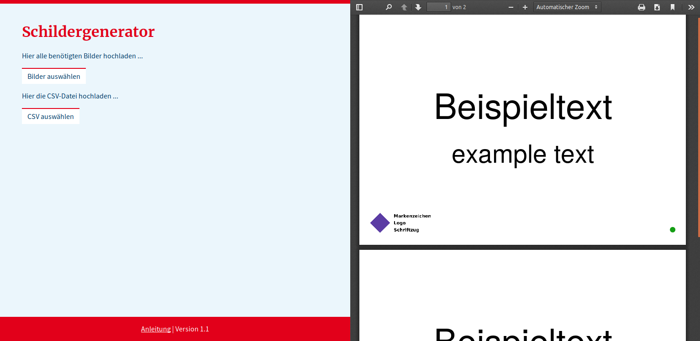

# Schildergenerator

Dieses Projekt ist ein Generator zur Erstellung von Beschilderungen. Anhand einer Liste von zu erstellenden Schildern in Form einer CSV-Datei werden die Schilder in der gewünschten Anzahl als PDF-Datei generiert. Außerdem werden automatisch ein alphabetischer Index, ein nach Kategorien geordnetes Inhaltsverzeichnis und je ein Inhaltsverzeichnis für jede vorhanden Kategorie erstellt.

Der Generator ist in JavaScript geschrieben und funktioniert komplett clientseitig. Dies ermöglicht eine Nutzung auf jedem System, auf dem ein moderner Webbrowser installiert ist, selbst wenn keine Internetverbindung vorhanden ist.

Einige Beispielschilder sind in der Datei [example.pdf](example.pdf) zu finden.

## Benutzung

Das Tool ist als Webseite konzipiert und wird daher mit dem Browser (z.B. Firefox, nicht mit dem Internet Explorer) geöffnet. Dafür ist *keine* Internetverbindung notwendig.

1. Die Datei `index.html` auswählen (Rechtsklick → Öffnen mit → Firefox).
2. Der Generator kann nun im Browser genutzt werden.
3. Weitere Hinweise zur Bedienung können durch einen Klick auf *Anleitung* in der Fußzeile der Webseite eingeblendet werden.

*Screenshot des Generators*

## Entwicklung

### Struktur

Der Quellcode in diesem Repository ist folgendermaßen aufgebaut:

* **/src/index.html** - Generator (Hauptseite).
* **/data/beschilderung.csv** - CSV-Datei mit Schildern.
* **/data/logo.jpg** - Beispiel-Logo.
* **/src/assets/main.js** - Hauptroutinen (Webseite, File handling, etc.).
* **/src/assets/main.css** - CSS des Generators.
* **/src/assets/lib.js** - Erweiterung der `jspdf` API um Funktionen zur Generierung einzelner PDF-Seiten (z.B. Schilder und Verzeichnisse).
* **/src/assets/imageData.js** - Base64 kodiertes Bild. Dieses wird als Logo auf jeder generierten Seite angezeigt.
* **/src/lib/** - Externe Bibliotheken (siehe unten).

### Eingebundene Bibliotheken
* `jspdf` [GitHub](https://github.com/MrRio/jsPDF)
* `jspdf AutoTable plugin` [GitHub](https://github.com/simonbengtsson/jsPDF-AutoTable)
* `Papa Parse` [GitHub](https://github.com/mholt/PapaParse)

> **Hinweis:**
> Die Libraries sind zur einfacherern Benutzung für Laien bereits im Ordner `/assets/lib/` vorhanden. Da diese stetig weiterentwickelt werden, sollten diese insbesondere für den Fall, dass der Generator serverseitig betrieben wird, durch aktuellere Versionen ersetzt werden.

## Daten

Eine bereits erstelle Liste von Schildern kann im Verzeichnis `/data/` gefunden werden. Aus urheberrechtlichen Gründen können an dieser Stelle keine Symbole/Bilder veröffentlicht werden.

Das Logo, welches auf jede Seite gedruckt wird, wird aus der Datei `/src/assets/imageData.js` geladen. Dies ist ein Base64-kodiertes Bild, welches beliebig ausgetauscht werden kann. Dafür muss ein Logo mit den Abmessungen 1422 Pixel x 614 Pixel (bzw. in diesem Seitenverhältnis) mit einem geeingeten Tool wie z.B. [BASE64 Image](https://www.base64-image.de/) kodiert werden. Eine Beispieldatei ist unter `/data/logo.jpg` zu finden.

### Welche Typen von Schildern gibt es?

Ein Schild kann je nach angegeben Inhalt einem der folgenden Typen zugeordnet werden.

| Titel | Untertitel | Bild | Beschreibung                                             |
| :---: | :--------: | :--: | :------------------------------------------------------- |
|   -   |     -      |  -   | Blanko.                                                  |
|   -   |     -      |  x   | Nur Bild  (Text wird nur in den Verzeichnissen genutzt). |
|   x   |     x      |  x   | Titel, Untertitel und Bild.                              |
|   x   |     x      |  -   | Nur Titel und Untertitel.                                |
|   x   |     -      |  -   | Nur Titel                                                |
|   x   |     -      |  -   | Nur Titel, max. 2 Zeichen, in extra großer Schrift.      |

### Was bedeuten die Felder in der CSV?
Jeder Eintrag der CSV-Datei, also jedes Schild, muss folgende Werte enthalten.

| Spaltenname    | Typ              | Optional | Beispiel   | Beschreibung                                                 |
| -------------- | ---------------- | -------- | ---------- | ------------------------------------------------------------ |
| Deutsch        | Text             |          | Handtücher | Deutscher Text (wird als Titel auf das Schild gedruckt).     |
| Englisch       | Text             | optional | towels     | Englischer Text (wird als Untertitel auf das Schild gedruckt). |
| Anzahl         | Zahl             |          | 3          | Ganzzahliger Wert, der angibt wie oft das Schild in der PDF-Datei vorhanden sein soll. |
| TextAnzeigen   | *ja* oder *nein* |          | ja         | Ja: Text wird auf das Schuld gedruckt. Nein: Text wird nicht auf das Schild gedruckt und nur im Inhaltsverzeichnis genutzt. |
| Kategorie      | Text             |          | Betreuung  | Kategorie, in die das Schild einsortiert werden kann (siehe unten). |
| Unterkategorie | Text             |          | Ausgabe    | Unterkategorie innerhalb der Kategorie.                      |
| Bild           | Text             | optional | towels.png | Dateiname (ohne Pfad) des Bildes, das auf das Schild gedruckt werden soll. |

#### Kategorien

Die Namen der Kategorien sind prinzipiell frei wählbar. Allerdings gibt es vordefinierte Kategorien, denen jeweils eine Farbe zugeordnet ist. So kann jedes Schild mittels eines aufgedruckten Farbpunktes der entsprechenden Kategorie zugeordnet werden.

Kategorien und Farben können in der Datei `main.js` angepasst werden.

## Lizenz
This work is licensed under a [Creative Commons Attribution-NonCommercial-ShareAlike 4.0 International License](http://creativecommons.org/licenses/by-nc-sa/4.0/).
